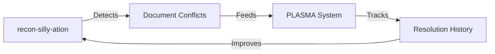

# recon-silly-ation Analysis

## What It Is

**recon-silly-ation** is a sophisticated documentation reconciliation system that:

1. **Scans repositories** for documentation
2. **Detects conflicts** between versions
3. **Resolves differences** automatically (with high confidence)
4. **Deduplicates content** using content-addressable storage
5. **Enforces consistency** through contractiles

## Key Features

### Technical Capabilities
- ✅ WASM-accelerated hashing (Rust)
- ✅ Deno runtime for security
- ✅ ArangoDB graph database backend
- ✅ 7-stage idempotent pipeline
- ✅ miniKanren/Datalog reasoning
- ✅ Haskell bridge for validation
- ✅ LLM integration (with guardrails)

### Reconciliation Pipeline
```
Scan → Normalize → Dedupe → Detect → Resolve → Ingest → Report
```

### Contractile Enforcement
- **Mustfile**: Invariants and validations
- **Trustfile.hs**: Cryptographic verification
- **Dustfile**: Rollback and recovery
- **Intentfile**: Roadmap alignment

## Relationship to PLASMA

### Overlap
Both systems deal with **documentation integrity** but from different angles:

| Aspect | recon-silly-ation | PLASMA |
|--------|-------------------|--------|
| **Focus** | Conflict resolution | Provenance tracking |
| **Approach** | Content reconciliation | Metadata management |
| **Scope** | Cross-repository | Single-repository |
| **Strength** | Conflict detection | Evolution tracking |

### Complementary Nature



**They work together beautifully:**
1. recon-silly-ation **finds** inconsistencies
2. PLASMA **tracks** the resolution process
3. Contractiles **enforce** consistency rules
4. Both systems **learn** from each other

## Should You Use It?

### Yes, If:
- ✅ You have **multiple repositories** with related docs
- ✅ You experience **documentation drift**
- ✅ You need **automated conflict resolution**
- ✅ You want **cryptographic verification** of docs
- ✅ You have **complex documentation ecosystems**

### No, If:
- ❌ You have a **single simple repository**
- ❌ You don't have **documentation conflicts**
- ❌ The complexity isn't justified
- ❌ You lack resources to maintain it

## Integration Options

### Option 1: Merge into PLASMA
**Pros:**
- Unified documentation integrity system
- Single maintenance point
- Combined capabilities

**Cons:**
- Increased complexity
- Different architectural approaches
- Integration effort required

### Option 2: Keep Separate, Link Systems
**Pros:**
- Clear separation of concerns
- Independent evolution
- Best-of-breed for each purpose

**Cons:**
- Two systems to maintain
- Integration points to manage
- Potential overlap

### Option 3: Shut Down, Extract Patterns
**Pros:**
- Simplifies architecture
- Focuses on PLASMA
- Reduces maintenance burden

**Cons:**
- Loses sophisticated conflict resolution
- Re-invent wheel later if needed
- May need to rebuild similar capabilities

## Recommendation

### **Hybrid Approach (Best of Both Worlds)**

1. **Keep recon-silly-ation** for its core strength: **conflict detection and resolution**
2. **Use PLASMA** for its core strength: **provenance and evolution tracking**
3. **Link them** through contractiles:
   - recon-silly-ation feeds conflicts to PLASMA
   - PLASMA tracks resolution history
   - Contractiles enforce consistency between both

### Implementation:

```yaml
# In PLASMA config
reconciliation:
  engine: recon-silly-ation
  conflict_feed: arango://recon-db/conflicts
  resolution_tracking: true

# In recon-silly-ation Mustfile
plasma_integration:
  enabled: true
  endpoint: plasma-api/v1/resolutions
  contractile: k9-svc-v3
```

## Specific Integration Points

### 1. Conflict Detection → Resolution Tracking
```
recon-silly-ation detects conflict → PLASMA tracks resolution → History preserved
```

### 2. Content Addressing → Provenance
```
recon-silly-ation hashes content → PLASMA tracks version history → Full audit trail
```

### 3. Graph Database → Document Relationships
```
recon-silly-ation builds relationship graph → PLASMA tracks evolution → Complete picture
```

## Decision Factors

### Keep Both If:
- You have **real documentation conflicts** across repos
- You need **automated resolution** capabilities
- You can **maintain both systems**
- The **value outweighs complexity**

### Shut Down If:
- You **don't have conflicts** to resolve
- PLASMA can **handle your needs** alone
- Maintenance is **too burdensome**
- You want to **simplify architecture**

## Migration Path

### If Shutting Down:
1. **Extract key patterns** (conflict detection algorithms)
2. **Document lessons learned** in PLASMA framework
3. **Archive the repository** for future reference
4. **Integrate key concepts** into PLASMA gradually

### If Keeping:
1. **Define clear boundaries** between systems
2. **Create integration contractiles**
3. **Document workflow** clearly
4. **Monitor maintenance burden**

## Final Recommendation

**Keep recon-silly-ation but integrate it with PLASMA through contractiles.**

This gives you:
- ✅ Sophisticated conflict resolution
- ✅ Complete provenance tracking
- ✅ Unified enforcement via contractiles
- ✅ Clear separation of concerns
- ✅ Path to simplify later if needed

The two systems complement each other perfectly - recon-silly-ation finds problems, PLASMA tracks solutions. Together they create a complete documentation integrity ecosystem.
